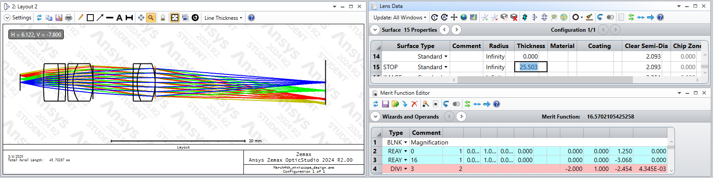
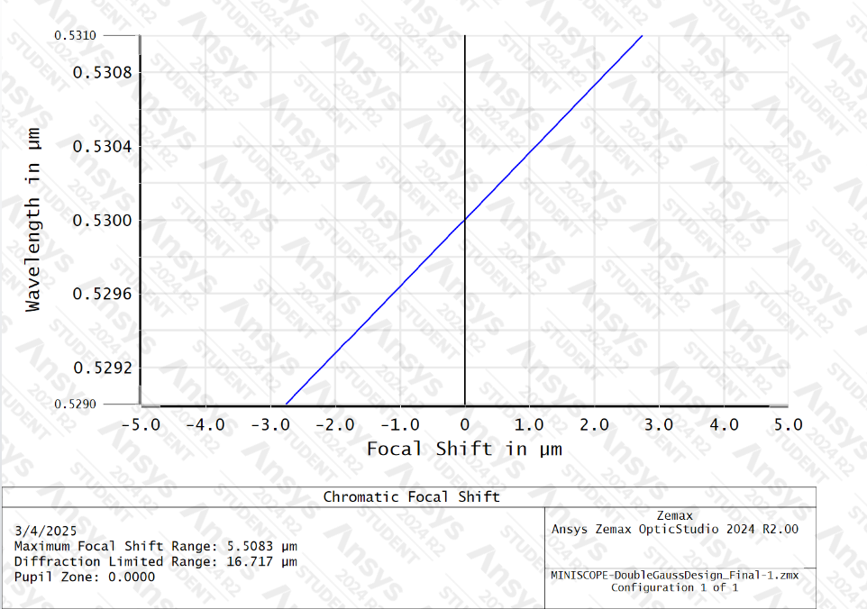
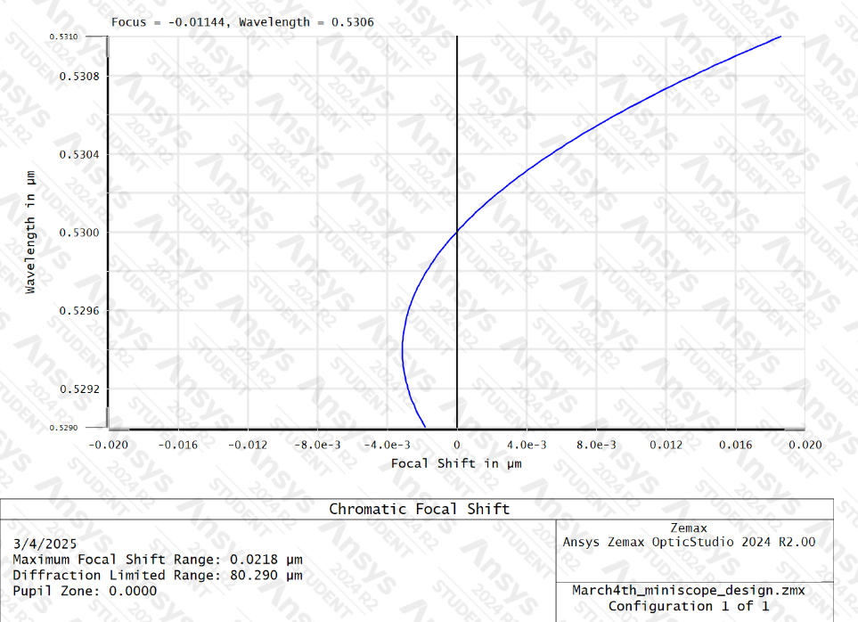
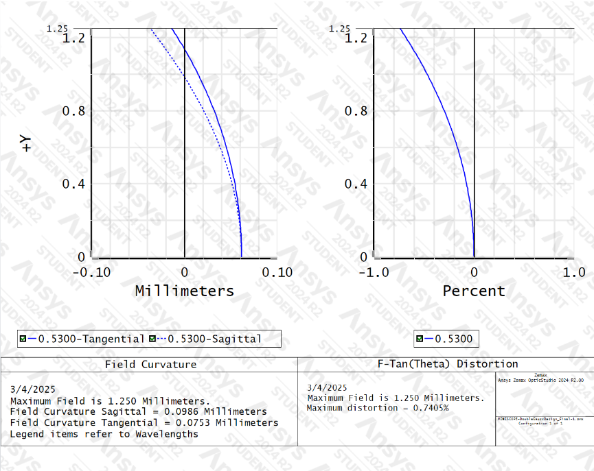
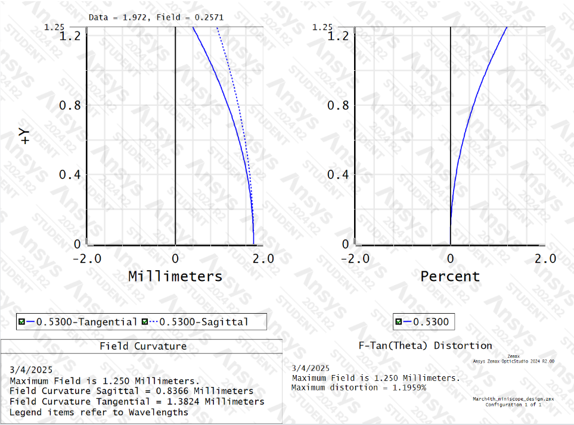

# Dual-Color Widefield Miniscope Optical Design Overview

## I. Objective
Achieve the highest possible image quality in the dual-channel miniscope while maintaining a minimum field of view (FOV) of 2.0 millimeters.

## II. Methods
Various optical simulation software was developed in Python and used Zemax OpticStudio to simulate the optical components in the miniscope in order to optimize the optics configuration for the objective. Only one method of increasing native image resolution within the current system was determined to be feasible: Increasing the magnification of the miniscope. However, increasing the magnification of an optical system also comes with the caveat of decreasing the FOV of the optical system so a balance must be struck for the design.

To increase the magnification of the miniscope, the most important factors for increasing magnification are the distance between the object plane and the first lens of the system and the properties of the individual lenses.

Other than the resolution, another problem with the previous models of miniscope is the significant amount of noise and chromatic aberration in its images. The solution to mitigate most of the aberration issues is to replace the plano-convex lenses in the previous designs with doublets. Moreover, the image quality can also be improved by increasing the intensity of the excitation light due to its interaction with the fluorescence in the cells that the miniscope is designed to capture.

### External Constraints
There are four main external constraints for the miniscope that the optical system must also abide to:
- Weight of the miniscope
- Center of mass of the miniscope
- Availability of optical components
- Cost of optical components

Due to the fact that the miniscope is designed to mount the head of a mouse, the weight of the miniscope has to remain under 4.5 grams. As such, the optical components that are used for the miniscope must also account for this factor. Notably, lenses with an increased diameter exponentially increase the weight of the system due to the necessity of increasing the dimension of the entire miniscope housing to accommodate such a change. After experimentations with lenses with a diameter up to 9mm, it was concluded that using any optical component with a diameter above 6mm would make it extremely challenging to fulfill this constraint.

The center of mass of the miniscope must also be considered to account for how it might affect the mice that the miniscope will be mounted on. While this metric was never defined quantitatively during the duration of the project, it was determined that it would be too risky to have a "tall" miniscope where the emission portion of the miniscope is directly above the object plane, even if it would slightly improve the image quality by not requiring the image to be reflected. The availability of off-the-shelf lenses as well as the cost of each optical component was also considered during the design process to ensure that the miniscope can be replicated in the future at a reasonable cost.

## III. Final Design
After numerous tests with different simulations and designs, the miniscope design was finalized and the most notable changes from the original designs are:
- Replaced the plano-convex lenses with doublets
- Moved the initial lens directly above the object plane, placing it significantly closer than before
- Increased the magnification of the system
- Increased the intensity of the excitation light by increasing focus of the LED light
- Modularized the CMOS mount of the miniscope, allowing for different CMOS to be used for the same miniscope
- Removed one dichroic mirror from the design, mirroring the captured image as a side effect


Figure 1: A simulation of the emission system of the miniscope in Zemax. The tables on the upper right lists each optical component within the system as well as the distance between. The table on the lower right showcases the magnification of the system.

Figure 2: A simulation of the excitation system of the miniscope in Zemax. The tables on the upper right lists each optical component within the system as well as the distance between.
## IV. Results
The new design of the miniscope successfully achieved the objective of the project and tackled the numerous challenges the previous design had. The current design is able to produce higher quality images by improving the image resolution, reducing chromatic aberration, and increasing the effectiveness of excitation.

### Image Resolution
As mentioned above, image resolution directly correlates with the magnification of the system. By placing the lenses of the system closer to the object plane and selecting the proper lenses, the magnification of the optical system increased from 0.9x to 2.45x, resulting in a resolution increase and FOV decrease by the same magnitude of 2.72x theoretically (value obtained by dividing 2.45 by 0.9).

The theoretical magnification of the image is calculated using the "Merit Function Editor" function in Zemax, as seen in Figure 2. To calculate the magnification, the "REAY" values (y-coordinate of a simulated light ray) at the object and image plane were extracted, denoted by the values 0 and 15 respectively on the table. Afterwards, the values were divided by each other using the following equation to obtain the magnification.

```
Magnification = REAY_Image / REAY_Object
```

The logic behind the calculation being that as an image is being magnified, individual light rays will land farther from the center point than they were originally, resulting in every light ray spreading out from the center point and resulting in a larger image. By capturing the position of the rays, we can calculate how much an image is magnified by calculating how much it deviated from the original coordinate.

### Chromatic Aberration
By replacing the plano-convex lenses with doublets, the significant chromatic aberration issues that the previous design suffered from were also almost mostly mitigated. The most significant effect of this improvement is eliminating the need to reposition the y-axis of the miniscope when switching between red and green channels when performing the relevant experiments. This improvement allowed for both channels to be captured with high native resolution when it is placed in a fixed position atop a mouse.

<table>
  <tr>
    <td></td>
    <td></td>
  </tr>
</table>
Figure 4: Comparison of chromatic aberration between the old design (left) and the new design (right) in Zemax. The chromatic aberration of the new design is significantly reduced as seen in the values on the x-axis of the graphs.


As shown in the first graph representing the old design, the focal shift of the image linearly shifts roughly 1μm for every wavelength shift of 0.0004μm. Considering the peak wavelength of each channel has a difference of roughly 0.08μm, it would mean that that we would need to shift the y-coordinate of the miniscope by 0.08μm/0.0004μm = 200μm every time a channel is switched in the old design, which aligns with what was observed experimentally. By comparison, the same wavelength shift of 0.0004μm in the new design results in a focal shift of less than 0.006μm in a non-linear parabolic trend, essentially reducing the effect of the chromatic aberration by more than 167%.

However, it should be noted that the new design performs slightly worse in some of the other aberration tests in Zemax, in categories such as field curvature, grid distortion, longitude aberration etc.


<table>
  <tr>
    <td></td>
    <td></td>
  </tr>
</table>
Figure 5: Comparison of field curvature between the old design (left) and the new design (right) in Zemax.

Notably the field curvature sagittal and tangential values of the old design increased from 0.0986mm and 0.0753mm respectively to 0.8366mm and 1.3824mm in the new design. The effect of these aberrations could not be observed by eye experimentally and it is not clear how much effect this has on image quality.

### Excitation
The effectiveness of the excitation was significantly improved by better focusing the LED light on the object. This was accomplished by using two plano-convex lenses in the excitation tower instead of one. Notably, this is the same lens used in the original design and the only change is the increase of quantity. Different lenses in different quantities were also considered but it was determined that three lenses would increase the focus too much, resulting in the excitation area on the object becoming too small. A suitable lens in Zemax that could replace the two-lens configuration with one single lens could not be found so the current design with two lenses is determined to be the best option at the time.

## V. Conclusion
The miniscope's performance and functionality were significantly optimized and improved upon with the changes brought about by the redesign. This report didn't address the filters components of the miniscope because they remain the same as the previous design and attempts at changing those components did not yield significant results. Should changes in magnification be needed in the future, the easiest method is to swap out the doublets, particularly the 15FL doublet. However, the position of the image plane, or the CMOS, would also need to be adjusted, since magnification positively correlates with focal length.