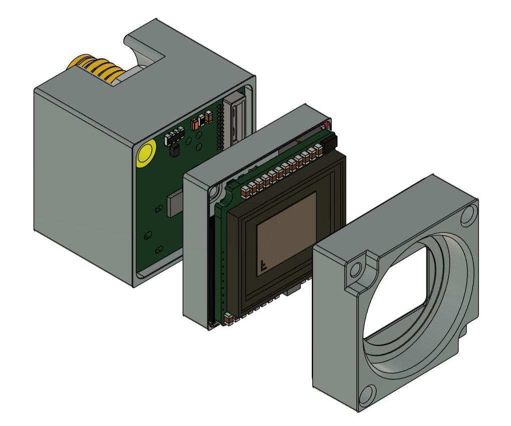
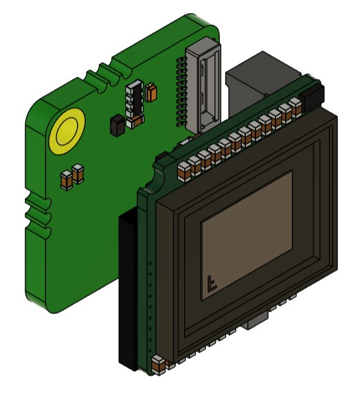
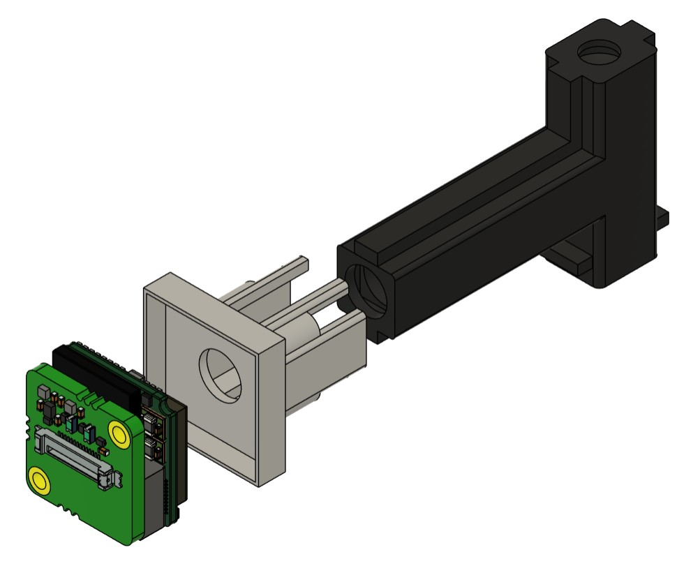

# CMOS Assembly and Installation Instructions

## ADPT-MU-CX3 Adapter Assembly Guide
This guide provides step-by-step instructions for disassembling the mu196 camera module and attaching the ADPT-MU-CX3 adapter.

## Required Components
- MU196 OR MU9 camera module
- MU196 OR MU9 housing mount
- ADPT-MU-CX3 adapter (MU196 only)
- CMOS specific printed mount
- Small Phillips screwdriver
- Clean, dust-free workspace

## MU196 Disassembly Steps (disregard if using the MU9)

### 1. Housing Removal
1. Identify the housing screws (located at corners of the gray housing)
2. Carefully remove all housing screws
3. Gently separate all housing from the assembly such that you are left with the exposed board level module

  

### 2. Attachment
1. Align the ADPT-MU-CX3 adapter with the CMOS module
2. Carefully connect the adapter to the CMOS module

  

## CMOS Installation
1. Simply place the camera module into its associated printed mount and slide the assembly onto the main mini-scope body

  

## Notes
- Handle the circuit board by its edges only
- Pay special attention to the orientation of components during reassembly
- If any components appear damaged, discontinue assembly and seek replacement parts