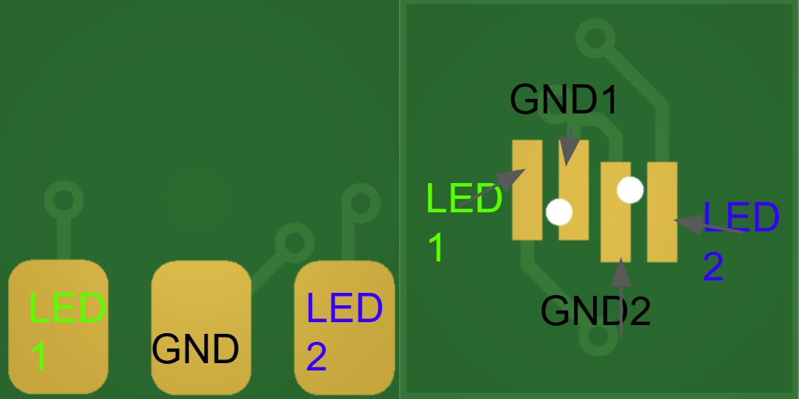
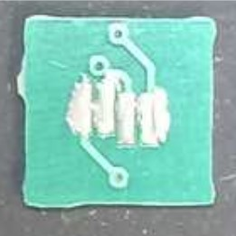
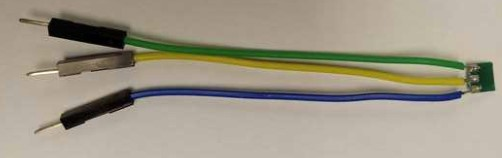
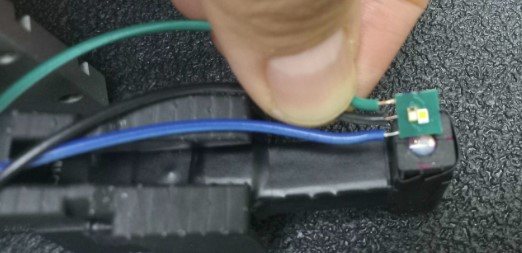

# Assembly - LED PCB

## Materials Needed
- LED PCB
- 2 LEDs
- Solder paste
- Soldering iron
- Black/Opaque electrical tape
- Wiring

## Assembly Steps

1. **Locate connection points**
   - Identify the ground, LED1 Vcc, and LED2 VCC pads on the PCB
   
   

2. **Apply solder paste**
   - Apply solder paste to each LED pad
   - Be careful not to bridge each pad with the paste
   
   

3. **Position LEDs**
   - Gently place both LEDs into their respective positions
   - Apply slight pressure so they sink slightly into the solder

4. **Solder LEDs**
   - Apply heat to the PCB from the opposite side until solder is fully melted
   - Ensure both LEDs are properly settled in place

5. **Wire connections**
   - Once solder has solidified, flip the PCB to solder each wire according to the first diagram
   
   

6. **Final positioning**
   - Position the PCB face down so both LEDs shine through the exit port
   - Secure with Black/Opaque electrical tape

   

## Notes
- Ensure proper orientation of LEDs before soldering
- Verify all connections are secure before final assembly
- The black electrical tape helps prevent light leakage 