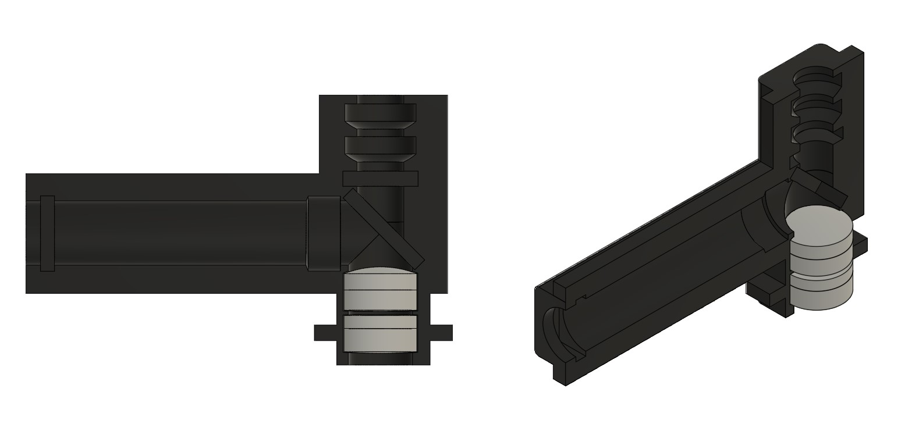
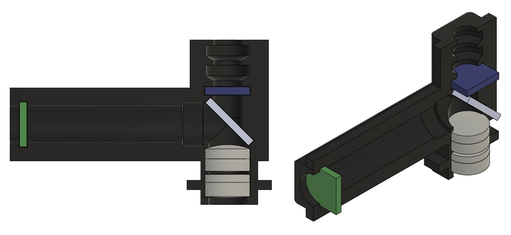
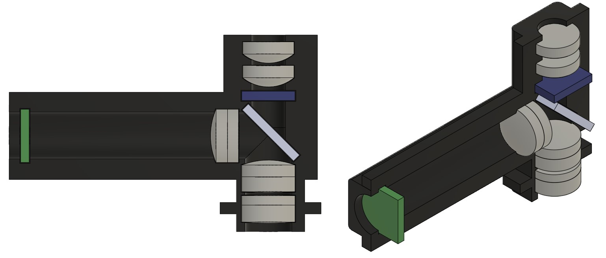

# Miniscope Assembly Instructions

## Required Components
Reference the Bill of Materials (BOM) for detailed part numbers and supplier information.

### Optical Components Needed
- 2× Plano-Convex Lens (O1)
- 1× 12.5mm FL Doublet (O3)
- 1× 60mm FL Doublet (O4)
- 1× Dichroic Filter (O7)
- 1× Excitation Filter - select either:
  - New design: ZET488/561x (O8) or
  - Previous design: 59022x (O9)
- 1× Emission Filter - select either:
  - New design: ZET488/561m (O5) or
  - Previous design: 59022m (O6)

### Housing Components Needed
- Main body (Y1)
- Lid body (Y2)

## Assembly Steps

### 1. Initial Preparation
- Clean all optical components with appropriate lens cleaning materials
- Verify all components are present and undamaged

  

### 2. Doublet Installation
1. Locate the excitation tower on the main body (Y1)
2. Install the pair of doublets in the excitation tower:
   - Position the 60mm FL doublet (O4) facing downwards, away from the excitation tower
   - Position the 12.5mm FL doublet (O3) facing upwards, toward the excitation tower

  

### 3. Filter Installation
1. Install the dichroic filter (O7)
   - Place in the excitation tower
   - **Important:** Reflective surface must face downwards, away from the excitation tower

2. Install the excitation filter (O8 or O9)
   - **Important:** Reflective surface must face the LED PCB (X1)

3. Install the emission filter (O5 or O6)
   - **Important:** Coating surface must face the excitation tower

  

### 4. Excitation Installation
1. Install the pair of Plano-Convex Lens (O1)
2. Install the final doublet lens (O2)

  

    
  

  

    
  

### 5. Final Installation
1. Align the lid body (Y2) with the main body (Y1)
2. Place assembled unit in vise
   - Hold for 0.5-1 hour
3. Final sealing
   - Carefully apply appropriate adhesive to seal the main body (Y1) and lid body (Y2) together
   - Ensure alignment is maintained during sealing

  

## Important Notes
- **Filter Orientation:** Double-check all filter orientations before final assembly
- **Component Verification:** All optical components should be free of dust and fingerprints before assembly
- **Quality Control:** Verify all components are securely seated before final sealing
- **Documentation:** Record which filter set design was used in your build

## Component Care
- Handle all optical components by their edges only
- Use appropriate lens cleaning materials only
- Store unused components in their original packaging
- Keep work area clean and dust-free during assembly

